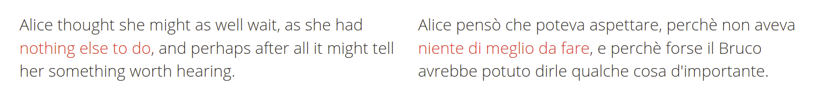

## Context
- In __domain-specific MT__ precision is often more important than coverage
- grammar-based pipelines (cf. GF) provide strong guarantees of __grammatical correctness__
- __lexical exactness__ is as important as grammaticality
  - need for high-quality __translation lexica__ preserving semantics _and_ morphological correctness

## Translation lexica
- often built __manually__
  - __time__ consuming
  - significant __linguistic knowledge__ required 
- need for at least partial __automation__ 
  - __example parallel data__ required

## A parallel corpus


From Lewis Carroll, _Alice's adventures in Wonderland_. Parallel text at `paralleltext.io`

## Alignment
Word alignment:


Phrase alignment: 


## Approaches to automation

| __statistical__ (e.g. IBM models) | __syntax-based__ |
| --- | --- |
| require __large amounts of data__ | work consistently well even on __individual sentence pairs__
|||
| works with __raw__ data | requires the data to be __analyzed__ |
|||
| correspondences between __strings__ | correspondences between __grammatical objects__
|||
| "fixed" level of abstraction (__word__ or __phrase__) | all levels of abstraction $\to$ __concept__ alignment|

## Our approach
- inconsistencies between different grammar formalisms $\to$ translation lexicon implemented in __GF__
- lack of robust constituency parsers while high-quality analysis is crucial $\to$ __UD__ parsing
- `gf-ud` for conversion


## Universal Dependencies

Graphical, CoNNL-U and Rose Tree representation of the same UD tree.

- framework for cross-linguistically consistent grammatical annotation
- dependency-labelled links between words (head-dependent pairs)
- cannot be used for target language generation
  
## Grammatical Framework
- constituency grammar formalism/programming language for __multilingual grammars__
  - one abstract syntax
  - multiple concrete syntaxes
- compilation-like approach to translation (parsing + linearization)

# Concept Extraction

## Definitions

__*Concept*__: semantic unit of compositional translation expressed by a word or construction, conceived as a lemma equipped with morphological variations.

__*Alignment*__: tuple of equivalent concrete expressions in different languages; represents a concept.

## Extraction algorithm


## Matching UD labels


- $\langle$_she missed the boat, ha perso il treno_$\rangle$ 
- $\langle$_missed the boat, perso il treno_$\rangle$ 
- *$\langle$_the boat, il treno_$\rangle$ 
- $\langle$_the, il_$\rangle$

Simple improvement: aligning heads of matching subtrees

- $\langle$_she missed the boat, ha perso il treno_$\rangle$, $\langle$_missed the boat, perso il treno_$\rangle$ $\to$ $\langle$_missed, ha perso_$\rangle$  (including the auxiliary)
- $\langle$_the boat, il treno_$\rangle$ 
$\to$ *$\langle$_boat, treno_$\rangle$ 


## POS equivalence
 

- more reliable __ignoring function words__ 
- in this case, basically same results as when matching labels 
- can increase recall when labels do not coincide 
- can increase precision if used __in conjuncion with labels__

## Known translation divergence
__Divergence__: systematic cross-linguistic distinction. 

- categorial
  - $\langle$_Gioara listens **distractedly**_, _Gioara lyssnar **distraherad**_$\rangle$
  - $\langle$_Herbert completed his **doctoral** thesis_, _Herbert ha completato la sua tesi **di dottorato**_$\rangle$ 
- conflational
  - $\langle$_Filippo is interested in **game development**_, _Filippo är intresserad av **spelutveckling**_$\rangle$ 
- structural
  - $\langle$_I called **Francesco**_, _Ho telefonato **a Francesco**_$\rangle$ 
- head swapping
  - $\langle$_Anna **usually** goes for walks_, _Anna **brukar** promenera_$\rangle$  
- thematic
  - $\langle$_**Yana** likes **books**_, _**A Yana** piacciono **i libri**_$\rangle$

## Known alignment
- allows using CA in conjunction with statistical tools 
- iterative application

## Searching for specific patterns
- `gf-ud` pattern matching allows looking for specific syntactic patterns 
- possible generalization via pattern replacement 

Example predication patterns:

- $\langle$_she missed the boat, ha perso il treno_$\rangle$ $\to$ $\langle$_[`subj`] missed [`obj`], ha perso [`obj`]_$\rangle$
- $\langle$_she told you that, hon berättade det för dig_$\rangle$ $\to$ $\langle$_[`subj`] told [`iobj`] [`obj`],[`subj`] berättade [`obj`] för [`obl`]_$\rangle$

# Grammar rules generation

## Requirements
- aligned UD trees 
- `gf-ud`  
- __morphological dictionaries__ 
- __extraction grammar__

## Morphological dictionaries
Purely morphological unilingual dictionaries.

Example:

```
...
lin morphologic_A = 
  mkAMost "morphologic" "morphologicly" ;
lin morphological_A = 
  mkAMost "morphological" "morphologically" ;
lin morphology_N = 
  mkN "morphology" "morphologies" ;
...
```

## Extraction grammar
Defines the syntactic categories and functions to build lexical entries. 

Example (prepositional NPs):

```
PrepNP : Prep -> NP -> PP # case head
```

## Lexical rules
Abstract:

```
fun in_the_field__inom_området_PP : PP ;
```

English concrete:

```
lin in_the_field__inom_område_PP = 
  PrepNP in_Prep (DetCN the_Det (UseN field_N))
```

# Evaluation

## Evaluating extraction
UD tree alignments are evaluated:

- independently from the quality of UD parsing (100-sentence subset of the manually annotated PUD corpus)
- on raw text (DMI and CSE course plans corpora)

## Results on PUD corpus
\begin{table}[h]
  \centering
  \tiny
  \begin{tabular}{r|c|c|c|c|c|c}
  \multicolumn{1}{l|}{\textbf{}} & \multicolumn{2}{c|}{\textbf{CE}} & \multicolumn{2}{c|}{\textbf{\begin{tabular}[c]{@{}c@{}}\texttt{fast\_align} \\(100 sentences)\end{tabular}}} & \multicolumn{2}{c}{\textbf{\begin{tabular}[c]{@{}c@{}}\texttt{fast\_align} \\(full dataset)\end{tabular}}} \\ \hline
  \multicolumn{1}{l|}{}          & \textbf{en-it}  & \textbf{en-sv} & \textbf{en-it}                              & \textbf{en-sv}                              & \textbf{en-it}                                & \textbf{en-sv} \\ \hline  
  \textbf{distinct alignments}        & 536             & 638            & 1242                                        & 1044                                        & 1286                                          & 1065          \\ 
  \textbf{correct}                & 392 (73\%)      & 514 (80\%)     & 346 (28\%)                                  & 538 (52\%)                                  & 540 (42\%)                                    & 677 (64\%)    \\ 
  \textbf{usable in MT}                      & 363 (68\%)      & 503 (79\%)     & 316 (25\%)                                  & 525 (50\%)                                  & 510 (40\%)                                    & 666 (63\%)    \\ 
  \end{tabular}
  \end{table}

  - CE module compared with `fast_align`, so extracting only one-to-many and many-to-one alignments
  - CE has much higher precision, even when `fast_align` is trained on full 1000-sentence corpus

## Results on course plans corpora
\begin{table}[h]
  \centering
  \tiny
  \begin{tabular}{r|c|c|c|c}
  \multicolumn{1}{l|}{\textbf{}} & \multicolumn{2}{c|}{\textbf{PUD (100 sentences)}} & \multicolumn{2}{c}{\textbf{\begin{tabular}[c]{@{}c@{}}\textbf{course plans}\end{tabular}}} \\ \hline
  \multicolumn{1}{l|}{}          & \textbf{en-it}  & \textbf{en-sv} & \textbf{DMI (881 sentences)}                              & \textbf{CSE (539 sentences)} \\ \hline  
  \textbf{distinct alignments}        & 1197             & 1325            & 1823                                        & 1950                                        \\ 
  \textbf{correct}                & 916 (77\%)      & 1112 (85\%)     & 1205 (66\%)                                  & 1269 (66\%)                                     \\ 
  \textbf{usable in MT}                      & 880 (74\%)      & 1099 (84\%)     & 1157 (63\%)                                  & 1248 (64\%)                                  \\ 
  \end{tabular}
  \end{table}

  - comparison between experiments on manually annotated treebanks and raw text
  - precision decreases, but is still higher than `fast_align`'s
  - recall much lower

## MT experiments
- no need to write an _ad hoc_ grammar: extend extraction grammar with existing RGL functions 
- 2 bilingual lexica from course plans corpora
- corpus of sentences to translate generated in the GF shell
  - semi-random lexical and grammatical variations on a set of semantically plausible sentences
- metric: BLEU scores
- reference translations obtained by manual postprocessing of the automatic ones 
  - avoid low scores due to different but equally valid lexical and grammatical choices

## Results
\begin{table}[h]
  \centering
  \scriptsize
  \begin{tabular}{r|cc}
  \textbf{}            & \textbf{DMI (en-it)} & \textbf{CSE (en-sv)} \\ \hline
  \textbf{BLEU-1 to 4} & 55         & 61         \\ 
  \textbf{BLEU-1 to 3} & 63         & 68         \\ 
  \textbf{BLEU-1 to 2} & 70         & 74          \\
  \textbf{BLEU-1}      & 79         & 81         \\ 
  \end{tabular}
  \label{tableu}
\end{table}

- better results for English-Swedish (due to systematic errors in Italian)
- sentence-level scores range from 0 (sometimes due to a single semantic error) to 100

## Conclusions
- extraction technique performing consistently well on small datasets
- simultaneous extraction of word, phrase, ... alignments, incl. discontinuous expressions
- can be used to look for specific types of correspondences, e.g. predication patterns
- automatic generation of compilable, morphology-aware GF translation lexica
- configurable to handle language pair- or corpus-specific divergences
- requires manual corrections and completions, but can reduce the time required for bootstrapping translation lexica significantly
- consists of a Haskell library + executables

## Current and future work

- Concept Propagation 
  - same text in new language (equivalent to multilingual CE)
  - new text in new language (within same domain)
- integration with statistical tools
- postprocessing tools