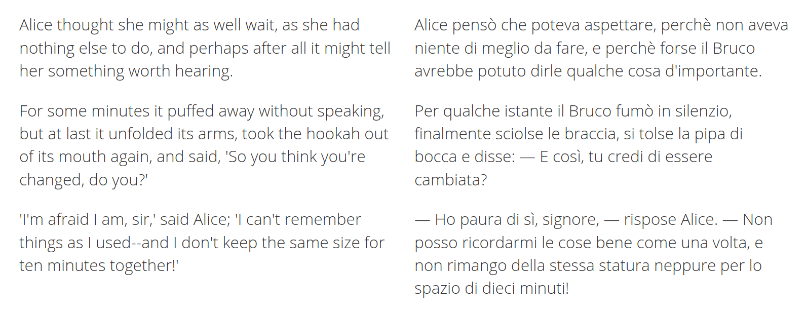

## Context
- GF is well suited for __domain-specific MT__ systems, where precision is more 
  important than coverage, as it provides strong guarantees of grammatical 
  correctness \pause
- in such systems, __lexical exactness__ is as important as grammaticality \pause
  - need for high-quality __translation lexica__ preserving semantics _and_
    morphological correctness

## The problem
- manually building a translation lexicon
  - is time consuming
  - requires significant linguistic knowledge \pause
- desire to __automate__ this process at least in part \pause
  - possible when __example parallel data__ are available

## A parallel corpus


From Lewis Carroll, _Alice's adventures in Wonderland_. Parallel text at `paralleltext.io`

## Alignment
Word alignment:


\pause

Phrase alignment: 


## Statistical approaches
Standard approaches are statistical (IBM models).

\pause

- __pros__: \pause
  - easy to use \pause
  - can handle noisy data \pause
  - fast on large corpora \pause
- __cons__: \pause
  - _require_ large amounts of raw data \pause
  - correspondences between strings \pause $\to$ no morphological info \pause
  - "fixed" level of abstraction (word, phrase or sentence)

## Grammar-based approaches
TODO:
- relation to prev syntax-based work

## Our approach
TODO: main features and advantages

## Concept Alignment
TODO: definitions:
- concepts: ...
- alignment: ...

## Grammatical Framework
- formalism/programming language to write __multilingual grammars__ $\to$ solves problem 1
  - one abstract syntax
  - multiple concrete syntaxes
  
\pause 

- compilation-like approach to translation $\to$ good, grammaticality-preserving target language generation
  
- but: problem 2 persist

## Universal Dependencies
- framework for cross-linguistically consistent grammatical annotation $\to$ same "multilingual" approach as GF \pause
- based on _dependency_, as opposed to constituency, relation
  - __dependency__: word-to-word correspondence
    - head
    - dependent in some relation with the head \pause
  
  
- easier target for a parser (e.g. UDPipe) $\to$ solves problem 2
- but: cannot be used for target language generation

## Solution: UD + GF


# Concept Extraction

## Extraction algorithm

## Aligning heads of maching trees

- $\langle$_the boat, il treno_$\rangle$ \pause
$\to$ *$\langle$_boat, treno_$\rangle$ \pause
- $\langle$_missed the boat, perso il treno_$\rangle$ \pause $\to$ $\langle$_missed, ha perso_$\rangle$ \pause (including the auxiliary)

## Alignment criteria
TODO: list them all

## Matching UD labels


\pause

- $\langle$_she missed the boat, ha perso il treno_$\rangle$ \pause
- $\langle$_missed the boat, perso il treno_$\rangle$ \pause
- *$\langle$_the boat, il treno_$\rangle$ \pause
- $\langle$_the, il_$\rangle$

## POS equivalence
 \pause

- more reliable __ignoring function words__ \pause
- in this case, basically same results as when matching labels \pause
- can increase recall when labels do not coincide \pause
- can increase precision if used __in conjuncion with labels__

## Known translation divergence
__Divergence__: systematic cross-linguistic distinction. \pause

- categorial
  - $\langle$_Gioara listens **distractedly**_, _Gioara lyssnar **distraherad**_$\rangle$
  - $\langle$_Herbert completed his **doctoral** thesis_, _Herbert ha completato la sua tesi **di dottorato**_$\rangle$ \pause
- conflational
  - $\langle$_Filippo is interested in **game development**_, _Filippo är intresserad av **spelutveckling**_$\rangle$ \pause
- structural
  - $\langle$_I called **Francesco**_, _Ho telefonato **a Francesco**_$\rangle$ \pause
- head swapping
  - $\langle$_Anna **usually** goes for walks_, _Anna **brukar** promenera_$\rangle$ \pause 
- thematic
  - $\langle$_**Yana** likes **books**_, _**A Yana** piacciono **i libri**_$\rangle$

## Known alignment
- allows using CA in conjunction with statistical tools \pause
- iterative application

## Searching for specific patterns
- `gf-ud` pattern matching allows looking for specific syntactic patterns \pause
- possible generalization via pattern replacement \pause

Example predication patterns:

- $\langle$_she missed the boat, ha perso il treno_$\rangle$ $\to$ $\langle$_[`subj`] missed [`obj`], ha perso [`obj`]_$\rangle$
- $\langle$_she told you that, hon berättade det för dig_$\rangle$ $\to$ $\langle$_[`subj`] told [`iobj`] [`obj`],[`subj`] berättade [`obj`] för [`obl`]_$\rangle$

# Grammar rules generation (TODO: shorten!)

## Requirements
- aligned UD trees \pause
- dependency configurayions for `gf-ud` \pause
- __morphological dictionaries__ \pause
- __extraction grammar__

## Morphological dictionaries
Purely morphological unilingual dictionaries.

\pause

Example:

```
...
lin morphologic_A = 
  mkAMost "morphologic" "morphologicly" ;
lin morphological_A = 
  mkAMost "morphological" "morphologically" ;
lin morphology_N = 
  mkN "morphology" "morphologies" ;
...
```

## Extraction grammar
Defines the syntactic categories and functions to build lexical entries. 

\pause

Example (prepositional NPs):

```
PrepNP : Prep -> NP -> PP # case head
```

## Lexical rules
Abstract:

```
fun in_the_field__inom_området_PP : PP ;
```

\pause

English concrete:

```
lin in_the_field__inom_område_PP = 
  PrepNP in_Prep (DetCN the_Det (UseN field_N))
```

# Evaluation

## Data

## Evaluating extraction
TODO: strategy

## Results on manually annotated treebanks
TODO: table 1

## Results on raw text
TODO: table 2

## MT experiments
TODO: strategy

## Results
TODO: tables 3-4or just 3 + comments

## Conclusions

## Future work
TODO: ?

- [ ] a 
- [x] b