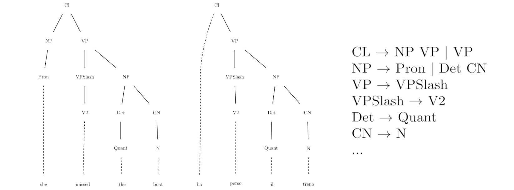
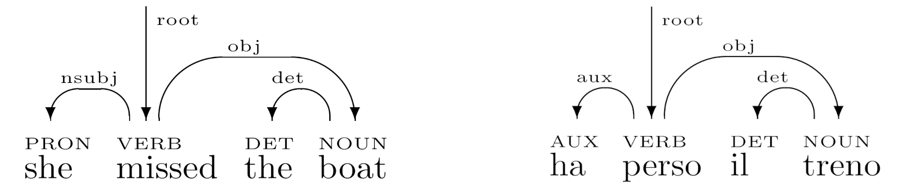
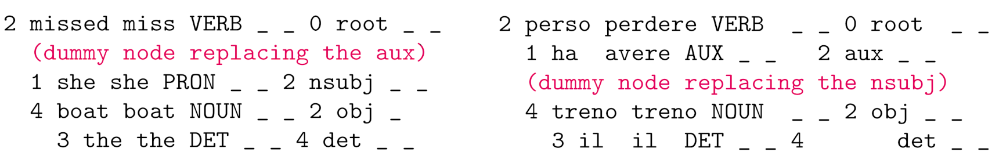
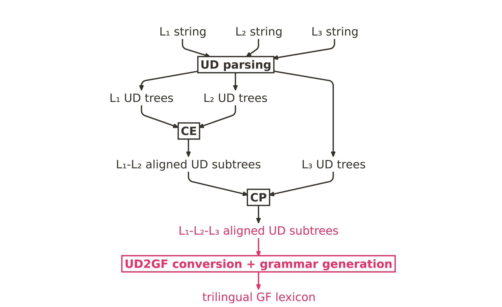

## A first definition
__Concept Alignment__: the task of finding semantical correspondences between parts of multilingual parallel texts.


## CA at different levels of abstraction
Word alignment:


\pause

Phrase alignment: 


## Subtasks
> - __Concept Extraction__: identifying new concepts via linguistic comparison
> - __Concept Propagation__: finding expressions corresponding to known concepts in a particular language

## CA in translation
A human translator \pause

1. recognizes concepts in the text to translate \pause
2. looks for ways to render them in the target language

\pause
...same idea behind _compositional_ Machine Translation.

## Semantic compositionality
The meaning of a complex expression is determined by:

- the meanings of its components (lexical semantics)
- the way its components are combined with each other (syntax)

\pause
The _translation_ of a complex expression is given by:

- the _translations_ of its components (lexical semantics)
- the way its components are combined with each other (syntax, taking cross-lingual divergences into account)

## Statistical approaches
Standard approaches to automation are statistical (IBM models)

Issues: \pause

> - "fixed" level of abstraction (generally either word or phrase alignment)
> - correspondences are between strings
> - need large amounts of raw data

## Syntax-based approaches
Alternative: tree-to-tree alignment 



\pause

> - ~~"fixed" level of abstraction~~ work at all levels of abstraction 
> - correspondences are between ~~strings~~ grammatical objects
> - ~~need large amounts of raw data~~ work consistently well even on single _analyzed_ sentence pairs

## Syntax-based approaches: issues
> 1. grammars often defined independently, so not compatible each other
> 2. lack of robust parsers, while the quality of the analyses is crucial

## Grammatical Framework
- formalism/programming language to write __multilingual grammars__ $\to$ solves problem 1
  - one abstract syntax
  - multiple concrete syntaxes
  
\pause 

> - compilation-like approach to translation $\to$ good, grammaticality-preserving target language generation
  
> - but: problem 2 persist

## Universal Dependencies
- framework for cross-linguistically consistent grammatical annotation $\to$ same "multilingual" approach as GF \pause
- based on _dependency_, as opposed to constituency, relation
  - __dependency__: word-to-word correspondence
    - head
    - dependent in some relation with the head \pause
  
  
> - easier target for a parser (e.g. UDPipe) $\to$ solves problem 2
> - but: cannot be used for target language generation

## Solution: UD + GF


# Concept Extraction

## Representations of UD trees


- CoNNL-U is the standard format for UD trees \pause
- internally to the CA module, they are represented as rose trees
  ```
  data RTree n = RTree n [RTree n]
  type UDTree = RTree UDWord
  type Alignment = (UDTree,UDTree)
  ``` 
    - `UDWord` represents a line of a CoNNL-u file 
    - alignments are pairs of ud trees

## Baseline
 \pause

1. recursively sort trees based on the UD label of their root node (not needed in this case) \pause
2. pad the trees $\to$ perfectly aligned trees
    \pause
3. extract alignments: \pause
   - subtrees: $\langle$_she missed the boat, ha perso il treno_$\rangle$, $\langle$_the boat, il treno_$\rangle$, $\langle$_the, il_$\rangle$ \pause
   - heads:$\langle$_missed, perso_$\rangle$, $\langle$_boat, treno_$\rangle$

## Multiple criteria
- __label matching__ (original criterion): trees in matching context are aligned if they have the same UD label  \pause
- __POS-equivalence__: trees in matching context are aligned if they have the same multiset of POS tags of their _meaning-carrying_ words 
  - meaning-carrying words $\simeq$ content words \pause
- __known alignment__: trees in matching context are aligned if an equivalent alignment is already known
  - counting

## Divergences
__Divergence__: systematic cross-linguistic distinction. \pause

- categorial
  - _Gioara listens **distractedly**_ VS _Gioara lyssnar **distraherad**_
  - _Herbert completed his **doctoral** thesis_ VS _Herbert ha completato la sua tesi **di dottorato**_ \pause
- conflational
  - _Filippo is interested in **game development**_ VS _Filippo är intresserad av **spelutveckling**_ \pause
- structural
  - _I called **Francesco**_ VS _Ho telefonato **a Francesco**_ \pause
- head swapping
  - _Anna **usually** goes for walks_ VS _Anna **brukar** promenera_ \pause
- thematic
  - _**Yana** likes **books**_ VS _**A Yana** piacciono **i libri**_

## Enhanced head alignment
- aligning head is extremely useful when alignment is perfect, like $\langle$_Claudio eats a banana,Claudio mangia una banana_$\rangle$
    - $\langle$_eats, mangia_$\rangle$
    - $\langle$_banana, banana_$\rangle$ \pause
- many problematic cases
  - some types of divergences $\to$ do not always align heads \pause
  - compounds & head verbs with auxiliaries $\to$ enhanced head alignment
    - $\langle$_many decisions were taken by Tommaso, många viktiga beslut togs av Tommaso$\rangle$ $\to$ $\langle$were taken, togs_$\rangle$
    - $\langle$_Giorgio took a course on machine learning techniques, Giorgio deltog i en kurs om maskininlärningstekniker_$\rangle$ $\to$ $\langle$_machine learning techniques, maskininlärningstekinker_$\rangle$

## Evaluation on PUD treebanks
__Against the baseline__
\begin{table}[h]
 \centering
 \scriptsize
 \begin{tabular}{|l|l|l|l|l|}
 \hline
   & \multicolumn{2}{l|}{\textbf{baseline}} & \multicolumn{2}{l|}{\textbf{improved version}} \\ \hline
 \textbf{}   & \textbf{en-it}  & \textbf{en-sv} & \textbf{en-it}  & \textbf{en-sv} \\ \hline
 \textbf{distinct} & 1097  & 1257 & 1198   & 1314  \\ \hline
 \textbf{correct} & 830 (58.12\%) & 995 (79.15\%)  & 964 (80.46\%) & 1105 (84.03\%) \\ \hline
 \textbf{useful} & 776 (54.34\%) & 976 (77.64\%)  & 896 (74.79\%) & 1082 (82.28\%) \\ \hline
 \end{tabular}
 \end{table}

\pause

__Against `fast_align`__ (en-it)
\begin{table}[H]
 \centering
 \scriptsize
 \begin{tabular}{|l|l|l|l|}
 \hline
  & \textbf{improved version} & \textbf{\texttt{fast\_align} (100)} & \textbf{\texttt{fast\_align} (1000)}\\ \hline
  \textbf{distinct} & 716 & 1440 & 1435 \\ \hline
  \textbf{correct} & 536 (74.86\%) & 410 (28.47\%) & 656 (45.71\%)\\ \hline
  \textbf{useful} & 491 (68.57\%) & 371 (25.76\%) & 590 (41.11\%)\\ \hline
 \end{tabular}
\end{table}

## Evaluation on "raw" data
Data: sentence-aligned Computer Science course plans

- CSE (GU/Chalmers)
- DMI (UniPG)
  
\begin{table}[H]
 \scriptsize
 \centering 
 \begin{tabular}{|l|l|l|}
 \hline
 \textbf{}   & \textbf{DMI (en-it, 798 sentences)} & \textbf{CSE (en-sv, 498 sentences)} \\ \hline
 \textbf{distinct} & 352  & 529  \\ \hline
 \textbf{correct} & 243 (69.03\%) & 368 (69.56\%) \\ \hline
 \textbf{useful} & 229 (65.05\%) & 351 (66.35\%) \\ \hline
 \end{tabular}
\end{table}

# Concept Propagation

## Two scenarios
 

\pause

> 1. 3+ lingual parallel text
> 2. 2 bilingual parallel texts with one language in common

## General algorithm
For each $L_1$-$L_2$ alignment: \pause

> 1. look for its $L_2$ member among all subtrees of the $L_2$ version of the text where it is to be propagated
> 2. if it is present, align the sentence it belongs to with its _TL_ conterpart with the same procedure used for CE
> 3. if multiple candidate alignments are found, select the one with the closest depths

## Caveats
> - in step 1, irrelevant details of UD trees are to be ignored
  > - only consider word form, lemma, POS tag and dependency relation
> - head alignments require special treatment as they are not composed of subtrees

## Evaluation: scenario 1
\begin{table}[H]
    \centering
    \scriptsize
    \begin{tabular}{|l|l|l|}
    \hline
    \textbf{}              & \textbf{en-sv} & \textbf{it-sv} \\ \hline
    \textbf{propagated}             & 1019 (85.05\%) & 979 (84.64\%) \\ \hline
    \textbf{tot. errors}            & 133 (13.05\%)  & 187 (19.1\%)  \\ \hline
    \textbf{CP-introduced}          & 75 (56.39\%)   & 84 (44.91\%)   \\ \hline
    \end{tabular}
\end{table}

- PUD treebanks
- the vast majority of concepts is propagated

## Evaluation: scenario 2

__Texts in different domains__ (subsets of PUD treebanks)
\begin{table}[H]
    \centering
    \tiny
    \begin{tabular}{|l|l|l|l|l|l|l|}
    \hline
    \textbf{}                     & \textbf{en-it-sv} & \textbf{it-en-sv} & \textbf{en-sv-it} & \textbf{sv-en-it} & \textbf{it-sv-en} & \textbf{sv-it-en} \\ \hline
    \textbf{extracted}   & 638               & 638               & 687               & 687               & 608               & 608               \\ \hline
    \textbf{propagated}                    & 92 (14.42\%)      & 92 (14.42\%)      & 98 (14.26\%)      & 84 (12.22\%)      & 101 (16.61\%)     & 87 (14.37\%)      \\ \hline
    \textbf{tot. errors}                   & 46 (50\%)         & 21 (22.82\%)      & 42 (42.85\%)      & 24 (28.57\%)      & 21 (20.79\%)      & 28 (32.18\%)      \\ \hline
    \textbf{CP-introduced}                 & 33 (71.73\%)      & 11 (52.38\%)      & 21 (50\%)         & 12 (50\%)         & 12 (57.14\%)      & 21 (75\%)         \\ \hline
    \end{tabular}
    \end{table}

- mostly function words and very common function words 

## Evaluation: scenario 2

__Texts in the same domain__ (course plans corpora)

\begin{table}[H]
    \centering
    \scriptsize
    \begin{tabular}{|l|l|l|}
    \hline
                           & \textbf{sv-en-it} & \textbf{it-en-sv} \\ \hline
    \textbf{extracted}     & 1950              & 1823              \\ \hline
    \textbf{propagated}             & 205 (10.51\%)     & 200 (10.97\%)     \\ \hline
    \textbf{tot. errors}            & 66 (32.19\%)      & 61 (30.5\%)       \\ \hline
    \textbf{CP-introduced} & 33 (50\%)        & 33 (54.09\%)      \\ \hline
    \end{tabular}
    \end{table}

- domain-specific concepts \pause
  - $\langle$_skills, färdigheter, capacità_$\rangle$, $\langle$_exam, tentamen, prova_$\rangle$... \pause
  - $\langle$_the aim of the course, syftet med kursen, l'obiettivo del corso_$\rangle$ \pause
  - an interesting error: $\langle$_learning, inlärning, conoscere_$\rangle$

# MT experiments

## What's left 


## From UD to GF alignments
- UD alignment postprocessing: \pause
  - normalization \pause
  - selection based on size and usefulness \pause
- conversion of UD trees into GF ASTs via `gf-ud`
  - dependency configurations

## From alignments to a grammar

- aligned ASTs used to automatically generate a GF translation lexicon \pause
- again via one of `gf-ud`'s modules
  - requires: __extraction grammar__, __morphological dictionaries__ \pause
- grammar generating simple sentences, limited variation:
  - _the sentence is simple_
  - _a sentence is simple_
  - _sentences are simple_
  - _these sentences are simple_
  - _this sentence is an example_
  - _this short sentence is simple_
  - _this sentence of the text is simple_

## Extending the grammar
Easy to add RGL categories and functions to allow more variation:

\pause

- _this sentence isn't simple_ \pause
- _is this sentence simple?_ \pause
- _this sentence was simple_ \pause
- _this sentence will be simple_ \pause
- _this sentence is simpler than that sentence_ \pause

Combining variations:

- _won't these short sentences be simpler than that long sentence?_

## Evaluation: strategy
- small course plans corpora $\to$ 2 bilingual lexica instead of a trilingual one \pause
- still small lexica + parsing issues $\to$ sentences to translate generated in the GF shell
  - partly arbitrary lexical and grammatical variations on a set of semantically plausible sentences \pause
- metric: BLEU scores \pause
- reference translations obtained by manual postprocessing of the automatic ones 
  - avoid low scores due to different but equally valid lexical choices

## Evaluation: results
\begin{table}[h]
    \centering
    \scriptsize
    \begin{tabular}{|l|l|l|}
    \hline
    \textbf{}            & \textbf{DMI (en-it)} & \textbf{CSE (en-sv)} \\ \hline
    \textbf{BLEU-1 to 4} & 55.4          & 61.27         \\ \hline
    \textbf{BLEU-1 to 3} & 62.75         & 67.77         \\ \hline
    \textbf{BLEU-1 to 2} & 70.6          & 74.3          \\ \hline
    \textbf{BLEU-1}      & 79.33         & 80.99         \\ \hline
    \end{tabular}
\end{table}

- max score:
  - $\langle$_the library provides useful textbooks, la biblioteca fornisce libri utili_$\rangle$
  - $\langle$_this lab is more difficult than the exam, den här laborationen är svårare än tentamen_$\rangle$ \pause
- min score:
  - $\langle$_the test is oral, la prova è dura_$\rangle$ \pause
- most errors are semantical, but 10% of the translation to Italian and 6% of those to Swedish only contain grammatical errors

# Conclusions and future work

## Conclusions
- developed a syntax-based CA module
  - Haskell library + easy to use and configure executables + evaluation and translation scripts \pause
- evaluation
    - against a baseline algorithm and a standard statistical tool
    - in a simple rule-based MT system 

## Future work
> - integration with statistical alignment techniques
> - verb phrases alignment
> - iterative CA
> - optimization of CP for multilingual corpora (scenario 1)
> - generalization of CE to $n$ languages
> - stricter and language pair-specific criteria
> - better alignment selection
