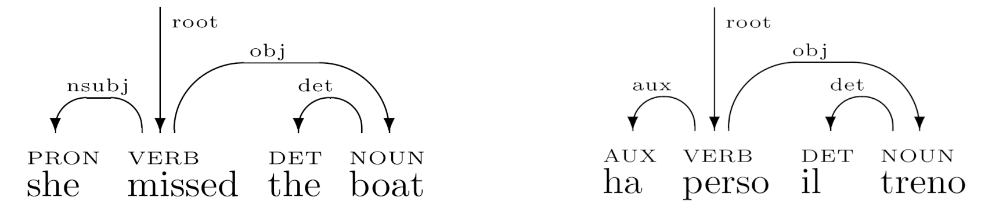

## Context
- GF is well suited for domain-specific MT systems where precision is more 
  important than coverage, as it provides strong guarantees of grammatical 
  correctness
- in such systems, __lexical exactness__ is as important as grammaticality 
  - need for high-quality __translation lexica__ preserving semantics _and_
    morphological correctness

## The problem
- manually building a translation lexicon
  - is time consuming
  - requires significant linguistic knowledge
- desire to __automate__ this process at least in part
  - possible when __example parallel data__ are available

## A parallel corpus


From Lewis Carroll, _Alice's adventures in Wonderland_. Parallel text at `paralleltext.io`

## Alignment
Word alignment:


Phrase alignment: 


## Statistical approaches
Standard approaches are statistical (IBM models).

- __Pros__:
  - easy to use
  - can handle noisy data
  - fast on large corpora
- __Cons__:
  - _require_ large amounts of raw data
  - correspondences between strings $\to$ no morphological info
  - "fixed" level of abstraction (word or phrase)

## Syntax-based approaches I
Alternative: tree-to-tree alignment.


## Syntax-based approaches II
Alternative: tree-to-tree alignment.


## Syntax-based approaches III
Alternative: tree-to-tree alignment.


## Comparison

| __statistical__ | __syntax-based__ |
| --- | --- |
| require large amounts of raw data | work even on single _analyzed_ sentence pairs
| correspondences between strings | correspondences between grammatical objects
| "fixed" level of abstraction | all levels of abstraction $\to$ __concept__ alignment|


## Why not just use GF?
- quality of the analysis is crucial
  - lack of robust GF parsers
- dependency trees are an easier target for a parser
  - robust parsers such as UDPipe

## Overview


1. parse parallel data to UD trees
2. search for aligned UD subtrees
3. convert them to GF trees and then grammar rules

## UD trees

Graphical, CoNNL-U and Rose Tree representation of the same UD tree.

- dependency-labelled links between words (head-dependent pairs)
- POS tags
- ...

# Extracting concepts

## Matching dependency labels


- $\langle$_she missed the boat, ha perso il treno_$\rangle$
- $\langle$_missed the boat, perso il treno_$\rangle$
- $\langle$_the boat, il treno_$\rangle$
- $\langle$_the, il_$\rangle$

## Aligning heads of maching trees


- $\langle$_missed, ha perso_$\rangle$ 
  - (incl. auxiliary in head)
- *$\langle$_boat, treno_$\rangle$
- $\langle$_the, il_$\rangle$

## Using POS tags


- more reliable ignoring function words
- in this case, same results as when matching labels
- can increase precision if used in conjuncion with labels
- can increase recall when labels do not coincide

## Translation divergences
__Divergence__: systematic cross-linguistic distinction. 

- categorial
  - $\langle$_Gioara listens **distractedly**_, _Gioara lyssnar **distraherad**_$\rangle$
  - $\langle$_Herbert completed his **doctoral** thesis_, _Herbert ha completato la sua tesi **di dottorato**_$\rangle$
- conflational
  - $\langle$_Filippo is interested in **game development**_, _Filippo är intresserad av **spelutveckling**_$\rangle$
- structural
  - $\langle$_I called **Francesco**_, _Ho telefonato **a Francesco**_$\rangle$
- head swapping
  - $\langle$_Anna **usually** goes for walks_, _Anna **brukar** promenera_$\rangle$ 
- thematic
  - $\langle$_**Yana** likes **books**_, _**A Yana** piacciono **i libri**_$\rangle$

## Reusing known alignments
- Allows using CA in conjunction with statistical tools
- iterative application

## Searching for specific patterns
- `gf-ud` pattern matching allows looking for specific syntactic patterns
- possible generalization via pattern replacement

Example predication patterns:

- $\langle$_`subj` missed `obj`,`subj` ha perso `obj`_$\rangle$
- $\langle$_`subj` told `iobj` `obj`,`subj` berättade `obj` för `obl`_$\rangle$

# Propagating concepts to a new language

## Concept Propagation
- So far, we focused on how to identify correspondences in bilingual parallel texts (_Concept Extraction_)
- what happens when we need to handle a third language?
  - _Concept Propagation_: finding expression corresponding to a known concept in a new language

## Scenario 1


## Scenario 2


# Generating grammar rules

## Requirements
- aligned UD trees
- extraction grammar
- morphological dictionaries

## Morphological dictionaries
Purely morphological unilingual dictionaries.

Example:

```
...
lin morphologic_A = 
  mkAMost "morphologic" "morphologicly" ;
lin morphological_A = 
  mkAMost "morphological" "morphologically" ;
lin morphology_N = 
  mkN "morphology" "morphologies" ;
...
```

## Extraction grammar
Defines the syntactic categories and functions to build lexical entries.

Example (prepositional noun phrases):

```
PrepNP : Prep -> NP -> PP # case head
```

## Lexical rules
Abstract:

```
fun in_the_field__inom_området_PP : PP ;
```

English concrete:

```
lin in_the_field__inom_område_PP = 
  PrepNP in_Prep (DetCN the_Det (UseN field_N))
```

# Refining the generated lexicon
- interactive selection
- CoNNL-U synoptic viewer

## Detailed overview


## Summary
- concept extraction (UD)
- concept propagation (UD)
- GF lexicon generation
- postprocessing tools

# Questions?